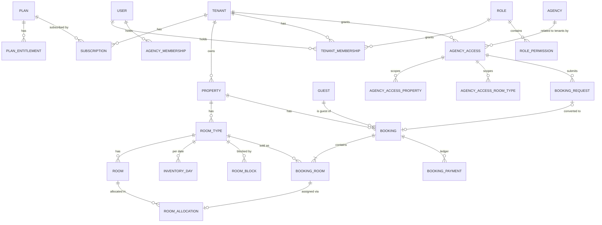

# Phase 5 — Database Architecture

PostgreSQL 16. Prisma handles schema, migrations and CRUD. Hand-written, parameterised SQL handles the parts Prisma can't express:
- the availability engine and its row locks
- exclusion and check constraints
- row-level security (RLS)

The pseudo-DDL below is the design. Phase 13 turns it into `packages/db/prisma/schema.prisma` plus `packages/db/sql/*.sql`.

## 1. Conventions

| Rule | Detail |
|---|---|
| Primary keys | `uuid` **UUIDv7** (time-ordered, index-friendly; never shown as a sequential number) |
| Tenant column | Every tenant-owned table has `tenant_id uuid not null` |
| Same-tenant references | Parents expose `UNIQUE (tenant_id, id)`. Children reference `(tenant_id, parent_id)` with **composite foreign keys**, so a row *cannot* point at another tenant's row even if application code is wrong. |
| Timestamps | `timestamptz` in UTC: `created_at`, `updated_at` on every table (omitted below) |
| Stay dates | `date` (property-local calendar date). Never `timestamptz`. |
| Money | `bigint` minor units + `char(3)` currency |
| Emails | `citext` |
| Deletes | No `ON DELETE CASCADE` on business data. Referenced records are archived (`archived_at`). |
| Enums | Postgres enums for closed sets (statuses). Tables for tenant-extensible lists (amenities). |
| Extensible settings | Typed columns for anything rules depend on; `jsonb settings` (validated by a Zod schema) for display preferences |
| Optimistic concurrency | `version int` on records edited by humans (booking, room type, agency access) |

## 2. Entity overview



## 3. Tables

### 3.1 Platform and subscription
```
plan                  id, code (uq), name, description, is_public, is_active, sort_order
plan_entitlement      id, plan_id → plan, key text, int_value int?, bool_value bool?   UQ(plan_id, key)
                        keys e.g. limit.properties, limit.rooms, limit.staff, limit.agencies,
                        feature.reports.advanced, feature.agentRequests, feature.overbooking
plan_price            id, plan_id → plan, currency char(3), interval (MONTH|YEAR), amount_minor bigint, is_active
tenant                id, name, slug citext uq, status (PENDING|ACTIVE|SUSPENDED|DEACTIVATED),
                        legal_name, country char(2), billing_email citext, overbooking_enabled bool=false,
                        require_staff_2fa bool=false, settings jsonb, activated_at, suspended_at, suspension_reason,
                        current_subscription_id uq   -- one current; FK (id, current_subscription_id) →
                                                     -- subscription(tenant_id, id), so it must be the tenant's own
subscription          id, tenant_id → tenant, plan_id → plan, status (TRIALING|ACTIVE|PAST_DUE|CANCELED|EXPIRED),
                        trial_ends_at, current_period_start, current_period_end, cancel_at, external_ref
tenant_entitlement_override  tenant_id, key, int_value?, bool_value?, reason, created_by   PK(tenant_id, key)
platform_setting      key pk, value jsonb, updated_by
```
**Effective entitlement** = tenant override, else plan entitlement, else platform default. Nothing is hard-coded (requirement "do not hard-code pricing").

### 3.2 Identity and access
```
user                  id, email citext uq, email_verified_at, password_hash (argon2id), name, phone,
                        status (INVITED|ACTIVE|LOCKED|DISABLED), failed_login_count, locked_until,
                        password_changed_at, totp_secret_enc bytea?, totp_enabled_at, last_login_at, locale
recovery_code         id, user_id, code_hash, used_at
session               id, user_id, token_hash bytea uq, context (PLATFORM|TENANT|AGENCY), tenant_id?, agency_id?,
                        support_grant_id?, mfa_verified_at, ip inet, user_agent, last_seen_at,
                        idle_expires_at, absolute_expires_at, revoked_at, revoke_reason
auth_token            id, user_id?, email citext, purpose (EMAIL_VERIFY|PASSWORD_RESET|INVITATION|AGENCY_INVITATION),
                        token_hash bytea uq, payload jsonb, expires_at, used_at, revoked_at
permission            key text pk, context, category, description            -- seeded from code
role                  id, context, tenant_id?, key, name, description, is_system bool, is_editable bool
                        UQ(tenant_id, key); UQ(tenant_id, id)
role_permission       role_id → role, permission_key → permission         PK(role_id, permission_key)
tenant_membership     id, tenant_id, user_id → user, role_id, is_owner bool, status (INVITED|ACTIVE|SUSPENDED|REVOKED),
                        all_properties bool=true, invited_by, accepted_at
                        UQ(tenant_id, user_id); FK (tenant_id, role_id) → role(tenant_id, id)
membership_property   tenant_id, membership_id, property_id   PK(membership_id, property_id)
                        FK (tenant_id, property_id) → property(tenant_id, id)
platform_membership   id, user_id uq, role_id, status
agency_membership     id, agency_id → agency, user_id, role_id, status      UQ(agency_id, user_id)
idempotency_record    tenant_id, key, user_id, route, request_hash bytea, status (IN_PROGRESS|DONE),
                        response_status int, response_body jsonb, expires_at     PK(tenant_id, key)
support_access_grant  id, tenant_id, granted_by, platform_user_id?, scope (READ_ONLY|READ_WRITE), reason,
                        starts_at, expires_at, revoked_at
```

### 3.3 Property and catalogue
```
property              id, tenant_id, name, code, type (HOTEL|RESORT|VILLA|HOMESTAY|HOSTEL|OTHER),
                        status (DRAFT|ACTIVE|INACTIVE|ARCHIVED), timezone text (IANA), currency char(3),
                        country, address_line1/2, city, region, postal_code, phone, email,
                        check_in_time time, check_out_time time, child_max_age smallint=12,
                        tentative_hold_hours int=48, low_availability_threshold int=2,
                        booking_horizon_days int=730, max_stay_nights int=90, booking_ref_prefix text,
                        agent_default_visibility (enum)='FULL_BREAKDOWN', agent_count_cap int=5,
                        agent_request_expiry_hours int=24, is_discoverable bool=false, settings jsonb, archived_at
                        UQ(tenant_id, id); UQ(tenant_id, code)
holiday               id, tenant_id, property_id?, date, name                -- null property = tenant-wide
amenity               id, tenant_id, name, icon        UQ(tenant_id, name)
file_object           id, tenant_id?, purpose, storage_key uq, mime_type, size_bytes, sha256,
                        scan_status (PENDING|CLEAN|INFECTED), uploaded_by
property_image        tenant_id, property_id, file_id, sort_order, caption
```

### 3.4 Inventory
```
room_type             id, tenant_id, property_id, name, code, description, max_adults, max_children, max_occupancy,
                        track_rooms bool=false, total_inventory int,          -- = active room count when track_rooms
                        base_rate_minor bigint?, status (ACTIVE|INACTIVE|ARCHIVED), sort_order, internal_notes,
                        version, archived_at
                        UQ(tenant_id, id); UQ(property_id, code)
                        CHECK (max_adults >= 1 AND max_children >= 0 AND max_occupancy >= 1
                               AND max_occupancy <= max_adults + max_children AND total_inventory >= 0)
room_type_amenity     tenant_id, room_type_id, amenity_id     PK(room_type_id, amenity_id)
room_type_image       tenant_id, room_type_id, file_id, sort_order, caption
room                  id, tenant_id, property_id, room_type_id, number, floor, building,
                        status (ACTIVE|INACTIVE|ARCHIVED), housekeeping (CLEAN|DIRTY|INSPECTED), notes, archived_at
                        UQ(property_id, number) WHERE archived_at IS NULL; UQ(tenant_id, id)

inventory_day         tenant_id, property_id, room_type_id, date date,
                        total int, booked int=0, held int=0, blocked int=0, out_of_service int=0,
                        overbook_allowance int=0, closed_all bool=false, closed_agents bool=false
                        PK(room_type_id, date); INDEX(property_id, date)
                        CHECK (all counters >= 0)
                        CHECK (booked + held + blocked + out_of_service <= total + overbook_allowance)

room_block            id, tenant_id, property_id, room_type_id, room_id?, kind (BLOCK|OUT_OF_SERVICE),
                        reason (MAINTENANCE|RENOVATION|OWNER_USE|GROUP_RESERVATION|VIP_RESERVATION|
                                TEMPORARY_CLOSURE|INTERNAL_ALLOCATION|OTHER),
                        quantity int, start_date date, end_date date,           -- [start, end)
                        original_end_date date, original_quantity int,
                        status (ACTIVE|RELEASED), notes, override_used bool, created_by, released_by,
                        released_at, release_reason
                        CHECK (end_date >= start_date AND quantity > 0)
                        CHECK (room_id IS NULL OR quantity = 1)

stop_sell             id, tenant_id, property_id, room_type_id?, start_date, end_date, scope (ALL_CHANNELS|AGENTS_ONLY),
                        reason, created_by, lifted_at, lifted_by

room_allocation       id, tenant_id, room_id, start_date, end_date,
                        booking_room_id? uq, room_block_id? uq
                        CHECK (num_nonnulls(booking_room_id, room_block_id) = 1)
                        EXCLUDE USING gist (room_id WITH =, daterange(start_date, end_date, '[)') WITH &&)
```

Notes:
- **`inventory_day` is a projection** maintained only by the engine (Phase 9). The CHECK constraint is the last line of defence against overselling.
- A released block keeps its row. `end_date` is truncated, and `original_end_date` preserves what was planned (for the Blocked Room report).
- `room_allocation` unifies booking assignments and room-specific OOS/blocks, so **one exclusion constraint** forbids every physical double-allocation.

### 3.5 Guests and bookings
```
guest                 id, tenant_id, first_name, last_name, email citext?, phone?, country char(2)?, notes,
                        anonymized_at                 INDEX(tenant_id, email), INDEX(tenant_id, phone),
                        GIN trigram INDEX on (first_name || ' ' || last_name) for search
booking_sequence      property_id pk, tenant_id, next_value bigint
booking               id, tenant_id, property_id, reference text, status
                        (INQUIRY|TENTATIVE|CONFIRMED|CHECKED_IN|CHECKED_OUT|CANCELLED|NO_SHOW|EXPIRED),
                        source (DIRECT|TRAVEL_AGENT|OTA|CORPORATE|WALK_IN|OTHER), source_detail text,
                        agency_access_id?, agency_id?,   -- the request→booking link lives on booking_request
                        guest_id, check_in date, check_out date,     -- header = min/max of active lines
                        adults int, children int,                    -- totals of active lines
                        special_requests, internal_notes,
                        currency char(3), total_amount_minor bigint?, paid_amount_minor bigint=0,
                        payment_status (UNPAID|PARTIALLY_PAID|PAID|PARTIALLY_REFUNDED|REFUNDED) -- derived cache
                        hold_expires_at, confirmed_at, checked_in_at, checked_out_at,
                        cancelled_at, cancelled_by, cancellation_reason, no_show_at,
                        created_by, updated_by, version
                        UQ(tenant_id, reference); UQ(tenant_id, id)
                        CHECK (check_out > check_in)
                        CHECK (source <> 'TRAVEL_AGENT' OR agency_access_id IS NOT NULL)
                        FK (tenant_id, property_id) → property; FK (tenant_id, guest_id) → guest;
                        FK (tenant_id, agency_access_id) → agency_access
                        INDEX(property_id, check_in), INDEX(property_id, check_out), INDEX(property_id, status)
booking_room          id, tenant_id, property_id, booking_id, room_type_id,
                        room_type_name_snapshot, room_type_code_snapshot,
                        check_in date, check_out date, adults, children, occupant_name?,
                        status (ACTIVE|CANCELLED), assigned_room_id?,
                        inv_from date, inv_to date,                     -- nights this line currently consumes
                        inventory_bucket (NONE|HELD|BOOKED),
                        amount_minor bigint?, cancelled_at, cancelled_by
                        CHECK (check_out > check_in AND inv_to >= inv_from)
                        INDEX(room_type_id, inv_from, inv_to)
booking_payment       id, tenant_id, booking_id, type (PAYMENT|REFUND|ADJUSTMENT), amount_minor bigint,
                        currency, method (CASH|CARD|UPI|BANK_TRANSFER|OTHER), reference, received_at, notes,
                        recorded_by                    -- append-only: app role has no UPDATE/DELETE
waitlist_entry        id, tenant_id, property_id, room_type_id?, check_in, check_out, rooms, adults, children,
                        guest_id?, contact_name, contact_email, contact_phone, source, agency_id?,
                        status (OPEN|NOTIFIED|CONVERTED|CLOSED|EXPIRED), notes, created_by, notified_at, booking_id?
```

Why `inv_from/inv_to/inventory_bucket` are stored on the line: every inventory change is then a provable function of stored rows. Reconciliation is a straight `SUM` (Phase 9 §12), and a cancellation's past nights stay recorded.

### 3.6 B2B
```
agency                id, name, legal_name, registration_number, tax_id, country, address, phone,
                        email citext, website, status (PENDING_VERIFICATION|ACTIVE|SUSPENDED|DEACTIVATED),
                        verified_at, verified_by
agency_access         id, tenant_id, agency_id → agency,
                        status (PENDING|ACTIVE|SUSPENDED|EXPIRED|REJECTED|DEACTIVATED),
                        pending_on (AGENCY|HOTEL)?, valid_from date?, valid_to date?,
                        visibility (STATUS_ONLY|CAPPED_COUNT|EXACT_COUNT|FULL_BREAKDOWN)?,  -- null = property default
                        count_cap int?, can_request_booking bool=false,
                        hotel_reference text, contact_name, contact_email, contact_phone,     -- hotel's view of contact
                        notes text,                                                          -- hotel-private
                        approved_at, approved_by, suspended_at, suspension_reason, version
                        UQ(tenant_id, agency_id); UQ(tenant_id, id)
agency_access_property  tenant_id, agency_access_id, property_id, all_room_types bool=false
                        PK(agency_access_id, property_id)
agency_access_room_type tenant_id, agency_access_id, property_id, room_type_id
                        PK(agency_access_id, room_type_id)
                        FK (agency_access_id, property_id) → agency_access_property
agent_search_log      id, tenant_id, property_id, agency_id, user_id, check_in, check_out, rooms, adults,
                        children, room_type_id?, result_summary jsonb, ip inet, created_at
                        -- partitioned monthly; retained 13 months
booking_request       id, tenant_id, property_id, agency_access_id, agency_id, requested_by, reference,
                        room_type_id, rooms, check_in, check_out, adults, children,
                        guest_name, guest_email, guest_phone, agent_notes, hotel_message,
                        status (PENDING|CONFIRMED|DECLINED|CANCELLED|EXPIRED),
                        responded_by, responded_at, booking_id?, expires_at
```

### 3.7 Events, notifications, audit, exports
```
outbox_event          id, tenant_id?, type, aggregate_type, aggregate_id, payload jsonb,
                        status (PENDING|PROCESSED|FAILED), attempts, available_at, processed_at, last_error
                        INDEX(status, available_at)
notification          id, tenant_id?, agency_id?, user_id, type, title, body, link, data jsonb, read_at
notification_delivery id, notification_id?, outbox_event_id?, user_id?, channel (IN_APP|EMAIL|SMS|WHATSAPP),
                        recipient, template_key, status (PENDING|SENT|FAILED|SKIPPED), attempts,
                        provider_message_id, last_error, sent_at
notification_preference user_id, context_id, event_type, channel, enabled     PK(user_id, context_id, event_type, channel)
notification_template  id, tenant_id?, event_type, channel, locale, subject, body, version, is_active
audit_log             id, created_at, tenant_id?, property_id?, actor_type (USER|SYSTEM|PLATFORM_ADMIN|AGENT|API_KEY),
                        actor_user_id?, actor_agency_id?, support_grant_id?, action text, entity_type, entity_id,
                        booking_id?, room_type_id?, summary text, before jsonb?, after jsonb?,
                        ip inet?, user_agent, request_id
                        PK(id, created_at) — PARTITION BY RANGE (created_at) monthly
export_job            id, tenant_id, requested_by, report_key, format (CSV|XLSX|PDF), params jsonb,
                        status (QUEUED|RUNNING|DONE|FAILED|EXPIRED), file_id?, row_count, error, completed_at, expires_at
```

## 4. Key relationships

- **Tenant 1–N Property 1–N RoomType 1–N Room.** Inventory is property-scoped; users and agencies are tenant-scoped.
- **Booking 1–N BookingRoom.** Each line is one room unit with its own type, occupancy and inventory footprint. Header dates and totals are derived from active lines.
- **BookingRoom 0..1–1 RoomAllocation 1–1 Room.** Assignment history is preserved through audit; the allocation row reflects the current assignment.
- **Agency N–M Tenant through AgencyAccess.** Scope is two levels: property (`all_room_types` or an explicit room type list).
- **User N–M Tenant through TenantMembership**, and N–M Agency through AgencyMembership. Platform membership is at most one per user.
- **Booking → Guest** is required. Anonymising a guest rewrites the guest's PII, never the booking.
- **Booking ↔ BookingRequest:** a request converts into at most one booking.

## 5. Constraint and security SQL (beyond Prisma)

```sql
CREATE EXTENSION IF NOT EXISTS citext;
CREATE EXTENSION IF NOT EXISTS btree_gist;
CREATE EXTENSION IF NOT EXISTS pg_trgm;

-- Overselling backstop
ALTER TABLE inventory_day
  ADD CONSTRAINT inventory_day_nonnegative CHECK (
    total >= 0 AND booked >= 0 AND held >= 0 AND blocked >= 0
    AND out_of_service >= 0 AND overbook_allowance >= 0),
  ADD CONSTRAINT inventory_day_capacity CHECK (
    booked + held + blocked + out_of_service <= total + overbook_allowance);

-- No physical double-allocation
ALTER TABLE room_allocation
  ADD CONSTRAINT room_allocation_no_overlap
  EXCLUDE USING gist (room_id WITH =, daterange(start_date, end_date, '[)') WITH &&);

-- Same-tenant composite FK pattern (repeated for every child table)
ALTER TABLE booking
  ADD CONSTRAINT booking_property_fk FOREIGN KEY (tenant_id, property_id)
  REFERENCES property (tenant_id, id);
```
One current subscription per tenant is modelled as `tenant.current_subscription_id` rather than a partial unique index, because Prisma doesn't manage partial indexes and would try to drop one in later migrations.

The full SQL is in `packages/db/prisma/migrations/*_integrity_and_rls/migration.sql`.

### Row-level security (second isolation layer)
```sql
-- Helper: fail closed. A missing or empty setting yields NULL, so no rows match.
CREATE FUNCTION app_tenant_id() RETURNS uuid LANGUAGE sql STABLE AS
  $$ SELECT NULLIF(current_setting('app.tenant_id', true), '')::uuid $$;

-- For every tenant-owned table. Runtime roles never own tables, so RLS always applies to them;
-- RLS is enabled rather than forced so that narrowly-scoped SECURITY DEFINER functions owned by
-- the migration role can return cross-tenant job candidates (tenant_id, id) to the worker.
ALTER TABLE booking ENABLE ROW LEVEL SECURITY;
CREATE POLICY tenant_isolation ON booking TO sd_app, sd_worker, sd_readonly
  USING (tenant_id = app_tenant_id())
  WITH CHECK (tenant_id = app_tenant_id());

-- Global tables visible only through relationships
CREATE POLICY agency_visible ON agency USING (
  id = NULLIF(current_setting('app.agency_id', true), '')::uuid
  OR id IN (SELECT agency_id FROM agency_access WHERE tenant_id = app_tenant_id()));
```
The API sets context per transaction with `SELECT set_config('app.tenant_id', $1, true)`. Transaction-local settings are safe behind PgBouncer in transaction mode.

### Database roles
| Role | Used by | Rights |
|---|---|---|
| `sd_owner` | Migrations only | Owns schema; never used at runtime |
| `sd_app` | API (tenant + agency contexts) | DML on operational tables, RLS enforced. `INSERT, SELECT` only on `audit_log`, `booking_payment`, `agent_search_log`. |
| `sd_platform` | API platform module | Tenant/plan/subscription/user/agency tables. **No grants on guest, booking, booking_room, booking_payment.** Aggregates come via `SECURITY DEFINER` functions that return counts only. |
| `sd_worker` | Background jobs | Like `sd_app`. Cross-tenant candidate selection (e.g. expired holds) via `SECURITY DEFINER` functions that return `(tenant_id, id)`; each item is then processed inside its tenant context. |
| `sd_readonly` | Reporting on read replica | `SELECT`, RLS enforced |

## 6. Volume and partitioning

| Table | Growth driver | Strategy |
|---|---|---|
| `inventory_day` | room types × 730 days (≈ 60 M rows at design point) | PK `(room_type_id, date)` keeps access local. Partition by date range (yearly) once > 100 M rows. |
| `audit_log` | every write | Monthly partitions created ahead by a job. Old partitions detached to cold storage per retention (default 7 years for booking actions). |
| `agent_search_log` | agent traffic | Monthly partitions, 13 months retention |
| `outbox_event` | every write | Processed rows purged after 7 days |

## 7. Data integrity rules mapped to mechanisms

| Requirement | Mechanism |
|---|---|
| Check-out after check-in | `CHECK (check_out > check_in)` + validation |
| Booking ≤ availability | Engine locks + `inventory_day_capacity` CHECK |
| Block ≤ availability unless authorised | Same CHECK; override raises `overbook_allowance` in the same transaction, audited |
| Deleting room types can't break history | No cascades; `archived_at`; name/code snapshots on lines |
| Cancelled bookings release inventory | Engine sets `inv_to` and bucket in the same transaction as the counters |
| Modified bookings recalculate inventory | Engine delta on the union of old and new footprints (Phase 9 §7) |
| Property timezone | Business date = `(now() AT TIME ZONE property.timezone)::date`, computed in one SQL helper and one TS helper |
| Concurrency | Ordered `FOR UPDATE` row locks, `lock_timeout`, retry on 40P01/40001/55P03 |
| Cross-tenant references impossible | Composite FKs + RLS |
| Audit can't be edited | No `UPDATE`/`DELETE` grant for runtime roles |
