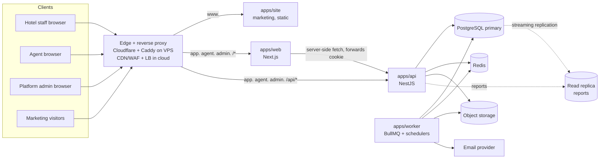

# Phase 6 — System Architecture

## 1. Stack decision

| Layer | Choice | Why |
|---|---|---|
| Language | TypeScript end-to-end (strict) | One type system across UI, API and shared domain rules |
| Frontend | **Next.js 16 (App Router) + React 19 + Tailwind CSS 4 + shadcn/ui (Radix)** | Server rendering for fast first paint, accessible primitives, design-system control |
| Client data | TanStack Query, TanStack Table, TanStack Virtual, React Hook Form + Zod | Caching/invalidation, large virtualised grids (calendar), typed forms |
| Backend | **NestJS (Fastify adapter)** as a separate API service | Explicit module boundaries, guards/interceptors for authz, DI for testability. Serves future mobile, agent and channel clients. Keeps domain logic out of UI routes. |
| Jobs | BullMQ on Redis + a NestJS standalone worker | Retries, scheduling, rate-limited delivery, separate scaling |
| Database | **PostgreSQL 16** | Row locks, CHECK/EXCLUDE constraints, RLS, partitioning, `daterange` |
| ORM | **Prisma** for schema, migrations and CRUD; `$queryRaw` tagged templates for the engine | Productivity + full SQL control where correctness matters. `$queryRawUnsafe` is banned by lint. |
| Validation | Zod schemas in a shared `contracts` package, used by web and API | One definition of "valid" |
| Cache / rate limit | Redis 7 | Sliding-window limits, principal cache, BullMQ |
| Files | S3-compatible object storage (private bucket, presigned URLs) | No files on app servers |
| Email | Provider adapter (Amazon SES / Postmark / Resend) | Swappable via `NotificationChannel` interface |
| Observability | OpenTelemetry traces, pino JSON logs, Sentry errors, Prometheus metrics | Request-ID correlation from browser to SQL |

Why not Next.js API routes for everything? The booking engine, locking, workers, a public agent API and future channel connectors need a long-lived, independently scalable service with module boundaries and an OpenAPI contract. Next.js stays a pure UI/BFF layer: it never talks to the database.

## 2. Topology



- **Hosting:** stage 1 is Docker Compose on VPS servers; stage 2 moves the same containers to managed cloud services. See [Phase 15](11-development-plan.md#3-phase-15--deployment-outline).
- **Same-origin API:** every portal host routes `/api/*` to the API service at the reverse proxy (Caddy on the VPS; the load balancer in the cloud). Session cookies are therefore **host-only `__Host-` cookies** with no CORS surface, and each portal's cookie is invisible to the others.
- The **marketing site** (`www.`) is a separate deployable with no session awareness. The authenticated app is never served from it.

## 3. Repository layout (pnpm + Turborepo monorepo)

```
staydesk/
  apps/
    site/        Next.js static marketing site: landing, pricing (from plans API), signup entry
    web/         Next.js app: route groups (hotel) (agent) (platform), host-based middleware
    api/         NestJS HTTP API
    worker/      NestJS standalone: queues, schedulers, outbox dispatcher
  packages/
    domain/      Pure TS, no I/O: LocalDate, stay math, availability formulas, booking state machine,
                 permission catalogue, visibility projection. 100 % unit-tested.
    contracts/   Zod request/response schemas + inferred types, error codes
    db/          Prisma schema, migrations, raw SQL (constraints, RLS, functions), seed, tenant-scoped client
    ui/          Design-system components and tokens
    config/      tsconfig, eslint (incl. security rules), tailwind preset, prettier,
                 brand.ts (product name, domains, support email, so a rename is a one-file change)
  infra/
    docker-compose.yml   postgres, redis, mailpit, minio (local dev)
    terraform/           cloud infrastructure (Phase 15)
  docs/
```

## 4. API module boundaries (NestJS)

| Module | Owns | Depends on |
|---|---|---|
| `auth` | login, sessions, MFA, tokens, password reset, invitations acceptance | identity, notifications |
| `identity` | users, memberships, roles, permissions, principal resolution | — |
| `tenancy` | request context (tenant/agency/property scope), tenant-scoped DB client | identity |
| `platform` | tenants, plans, subscriptions, entitlements, platform stats, settings | identity (sd_platform DB role) |
| `entitlements` | limit and feature checks | platform (read) |
| `properties` | properties, settings, holidays, images | tenancy |
| `inventory` | room types, rooms, blocks, OOS, stop-sell, **InventoryLedger** (sole writer of `inventory_day`) | tenancy |
| `availability` | read models: grid, stay search, classification, agent projection | inventory (read) |
| `bookings` | booking engine, guests, payments, waitlist, room assignment, booking calendar | inventory (ledger), availability |
| `b2b` | agencies, agency access, agent portal endpoints, booking requests, search log | availability, bookings (for request conversion) |
| `reports` | report queries, export jobs | read replica |
| `notifications` | outbox consumers, templates, channels (email, in-app; SMS/WhatsApp adapters later) | — |
| `audit` | `AuditWriter` (transactional), audit queries | — |
| `files` | presigned uploads, validation, image processing | — |
| `health` | liveness/readiness, platform health metrics | — |

Rule: **only `inventory.InventoryLedger` may write `inventory_day`**. This is enforced by a lint rule on SQL strings plus code review. Bookings and blocks call the ledger inside their own transactions.

## 5. Request lifecycle

```
CDN/WAF → LB (host → portal; /api → API)
  → requestId + OTel span
  → security headers, body-size limit (1 MB JSON)
  → rate limiter (Redis; per IP, per user, per tenant, per route class)
  → session guard (cookie → session row → principal; portal-host/context match)
  → CSRF guard (unsafe methods: Origin check + X-CSRF-Token)
  → permission guard (@RequirePermission) + scope guard (@PropertyScoped) + agency policy
  → Zod validation pipe (strict: unknown keys rejected)
  → controller → service (domain rules) → tenant-scoped repository
      → transaction: set_config(app.tenant_id) … writes … AuditWriter … Outbox
  → audience-specific response mapper (field-level stripping)
  → exception filter → RFC 9457 problem+json (no stack traces; requestId included)
```

## 6. Background jobs (worker)

| Job | Schedule | Purpose |
|---|---|---|
| Outbox dispatcher | continuous (poll 500 ms, `FOR UPDATE SKIP LOCKED`) | Fan out domain events to notifications, waitlist matcher, future webhooks/channels |
| Hold expiry | every minute | Expire tentative bookings past `hold_expires_at`; warn 2 h before |
| Agency access expiry | hourly | Set `EXPIRED`, notify both sides (7-day warning + expiry) |
| Booking request expiry | every 5 min | Expire pending agent requests |
| Inventory horizon roll | nightly per property timezone | Pre-create `inventory_day` rows to horizon |
| Reconciliation | nightly | Recompute counters from source rows; alert on drift (Phase 9 §12) |
| Waitlist matcher | event-driven | Match released inventory to open entries |
| Notification delivery | queue | Email send with retry/backoff; provider webhooks for bounces |
| Export generation | queue | CSV/XLSX streaming; PDF via headless Chromium for summaries |
| Partition maintenance | monthly | Create future partitions for `audit_log`, `agent_search_log` |
| Session/token cleanup | daily | Purge expired sessions, tokens, idempotency records |

Every job is idempotent, tenant-context-correct, and records its runs (`job_run` metrics) for the System Health page.

## 7. Domain events (outbox) — the integration backbone

Written in the same transaction as the change. Delivery is at-least-once, and consumers deduplicate by event ID.

`booking.created`, `booking.modified`, `booking.cancelled`, `booking.statusChanged`, `booking.holdExpiring`, `booking.holdExpired`, `block.created`, `block.released`, `inventory.changed {propertyId, roomTypeId, from, to}`, `availability.low`, `availability.full`, `agencyAccess.statusChanged`, `bookingRequest.created|responded`, `user.invited|created|suspended`, `auth.passwordChanged`, `waitlist.matched`.

Future connectors subscribe without touching booking code:
- channel-manager ARI push ← `inventory.changed`
- accounting/Tally ← `booking.*` and payments
- WhatsApp/SMS ← notification channel adapters
- webhooks ← any event, HMAC-signed

## 8. Scalability and reliability

- **Stateless API and web** scale horizontally behind the LB. Sessions live in Postgres, with a Redis cache for the principal.
- **Contention is minimal by design.** Booking locks only the `(room_type, date)` rows it touches. Two bookings conflict only when they compete for the same room type on the same nights, which is exactly when serialisation is required.
- **PgBouncer** in transaction mode. Tenant context via `set_config(..., true)` is transaction-local and safe.
- **Read replica** for reports and exports. The availability engine and booking flows always use the primary.
- **Timeouts everywhere:** `lock_timeout 3s`, `statement_timeout 10s` (engine), 30 s for report queries on the replica, HTTP 15 s.
- **Graceful degradation:** if Redis is unavailable, rate limiting fails closed for auth routes and open (with logging) for read routes; booking correctness never depends on Redis.
- **Feature flags** (platform settings + entitlements) gate P1/P2 features per tenant.

## 9. Environments

| Env | Purpose | Data |
|---|---|---|
| local | docker-compose (Postgres, Redis, Mailpit, MinIO) | Seed script with demo tenants |
| CI | Testcontainers Postgres/Redis per test run | Ephemeral |
| staging | Production-like, smaller | Synthetic only (no production PII) |
| production | Multi-AZ | Real |

Configuration via environment variables validated at boot with Zod; secrets from the cloud secret manager. The web app receives **no secrets**: only `NEXT_PUBLIC_*` values that are safe to publish, and a lint rule rejects secret-looking names with that prefix.
