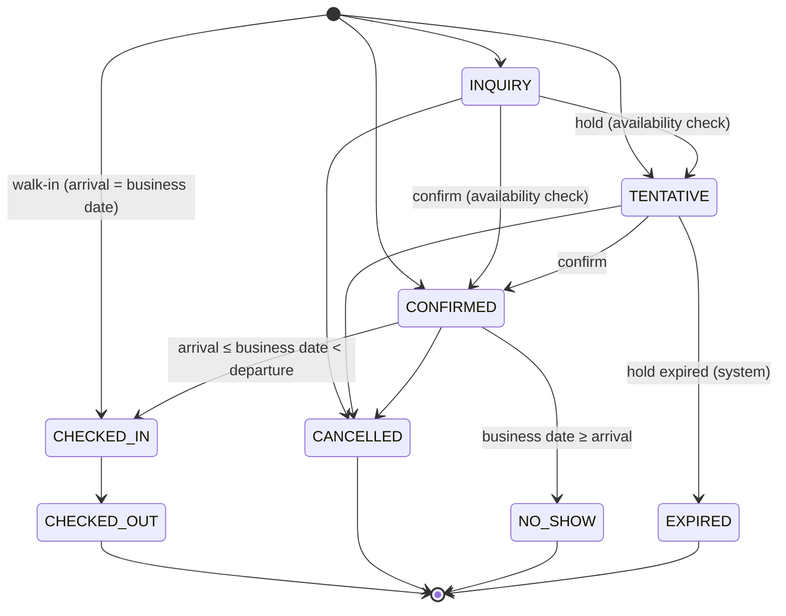

# Phase 10 — Booking Engine

## 1. Aggregate

- **Booking** (header): reference, status, source, guest, header dates (min/max of active lines), totals, notes, money snapshot, hold, lifecycle timestamps, `version`.
- **BookingRoom** (line, one per room unit): room type (+ name/code snapshot), dates, occupancy, line status `ACTIVE | CANCELLED`, assigned room, inventory footprint `[inv_from, inv_to)` + bucket.
- **Guest** (tenant-scoped, reusable), **BookingPayment** (append-only ledger, P1).

In v1 the header carries the lifecycle status for all active lines. Lines can be individually cancelled (partial cancellation) while the booking stays active. Per-line check-in for staggered group arrivals is P2.

## 2. State machine



| Status | Inventory bucket of active lines | Editable |
|---|---|---|
| INQUIRY | NONE | everything |
| TENTATIVE | HELD (until `hold_expires_at`) | everything |
| CONFIRMED | BOOKED | everything |
| CHECKED_IN | BOOKED | departure date, occupancy, notes, assignment (room move) |
| CHECKED_OUT / CANCELLED / NO_SHOW / EXPIRED | NONE for future nights | internal notes; payments (P1) |

P1 corrective transitions, each with its own permission and audit:
- **Reinstate** CANCELLED/EXPIRED/NO_SHOW → CONFIRMED, as a full re-reservation with an availability check
- **Undo check-in** (same business day only)

## 3. Create booking pipeline

| # | Step | Detail |
|---|---|---|
| 1 | Authenticate / authorise | `booking.create` in property scope; tenant active; `booking.backdate` / `inventory.override` if those options are used |
| 2 | Validate schema | Zod strict: dates `YYYY-MM-DD`, ≥ 1 line, occupancy integers, guest (id or new guest fields), source rules (TRAVEL_AGENT ⇒ agencyAccessId of this tenant, active or recently active) |
| 3 | Idempotency | Look up `(tenant, Idempotency-Key)`: DONE → replay the stored response; IN_PROGRESS → 409; different hash → 422. Otherwise insert IN_PROGRESS (own short transaction). |
| 4 | Business rules | BR-01/04/05 (dates, past, horizon, max stay), room types ACTIVE in this property, BR-12 occupancy per line, plan entitlements |
| 5 | Duplicate check | BR-21 (unless `acknowledgeDuplicate`) |
| 6 | **BEGIN** | Set tenant context, `lock_timeout`, `statement_timeout` |
| 7 | Guest | Create, or load by id `FOR SHARE` (must belong to this tenant via composite FK) |
| 8 | **Reserve inventory** | `InventoryLedger.apply(+HELD or +BOOKED per line)`. This rechecks inventory, date range, existing reservations, blocks and OOS, and recalculates availability under row locks: steps 1–7 of the brief's overbooking protection. |
| 9 | Reference | `UPDATE booking_sequence SET next_value = next_value + 1 WHERE property_id = $p RETURNING next_value` → `PREFIX-YY-000123` |
| 10 | Persist | Insert booking + lines (with `inv_from/inv_to/bucket`), optional `room_allocation` rows for chosen rooms (exclusion constraint), `hold_expires_at` for TENTATIVE |
| 11 | Audit + outbox | `AuditWriter.write({action: 'booking.create', summary: 'Asha created Booking GOA-26-004217', after})` and `booking.created` + `inventory.changed` events |
| 12 | Idempotency DONE | Store the response body in the same transaction |
| 13 | **COMMIT** | Step 8 of the brief: "Confirm booking" |
| 14 | After commit | Worker sends notifications (email/in-app) from the outbox |

Failure anywhere in steps 6–13 rolls back everything, including the inventory change, and the idempotency record returns to a retryable state. Retryable database errors re-run steps 6–13 (Phase 9 §5).

## 4. Modify booking

Input: `PATCH` with `If-Match: "v{version}"` and any of: dates per line or for all lines, room type per line, add/remove lines, occupancy, guest, source, notes, money, hold.

```
BEGIN
  SELECT … FROM booking WHERE id = $id FOR UPDATE      -- lock aggregate (lock order step 1)
  version ≠ If-Match → 412 PRECONDITION_FAILED
  status allows the change? (table §2) else INVALID_STATUS_TRANSITION
  oldFootprint = active lines' [inv_from, inv_to) × bucket × room type
  newFootprint = computed from the patched lines (for CHECKED_IN: inv_from stays, only inv_to moves)
  InventoryLedger.apply(newFootprint − oldFootprint)    -- netted per night; only increases are checked
  update allocations: shift [start, end) for assigned rooms → exclusion violation ⇒ 409 ROOM_UNAVAILABLE_FOR_NEW_DATES
  update lines/header, recompute header dates and totals, version + 1
  audit (before/after diff), outbox booking.modified (+ inventory.changed)
COMMIT
```
Shortening a stay or removing rooms never fails on availability. Extending it into a full night fails as a whole, and the original booking stays exactly as it was (BR-16, test MD-01).

## 5. Cancel

- Input: `{ lineIds?: Uuid[], reason: string }`. No `lineIds` means the whole booking.
- Allowed from INQUIRY, TENTATIVE, CONFIRMED. Not from CHECKED_IN (use check-out) or terminal states.
- For each line: `apply(−bucket over [max(inv_from, businessDate), inv_to))`, then `inv_to ← max(inv_from, businessDate)`, `bucket ← NONE`, `status ← CANCELLED`. Allocations are truncated to the same date, or deleted if wholly in the future.
- If all lines are cancelled, the header becomes CANCELLED with `cancelled_at/by/reason`.
- Payments are untouched. A refund is a separate ledger entry, and cancellation fees/policies are P2.
- Outbox `booking.cancelled` → notifications + waitlist matcher.
- Cancelling an already-cancelled booking with the same Idempotency-Key replays; without it → 409 `INVALID_STATUS_TRANSITION`.

## 6. Front-desk transitions

| Action | Preconditions | Inventory effect |
|---|---|---|
| Check-in | CONFIRMED; `checkIn ≤ businessDate < checkOut`; tracked types have rooms assigned (ROOM_ASSIGNMENT_REQUIRED otherwise) | none (already BOOKED). If business date > checkIn (late arrival), the skipped nights stay booked as history. |
| Walk-in | Create with status CHECKED_IN, `checkIn = businessDate` | `+BOOKED` (full check) |
| Check-out | CHECKED_IN | If `businessDate < checkOut`: early departure → `−BOOKED [businessDate, checkOut)`, `inv_to`/allocation truncated. If `businessDate > checkOut`: rejected (OVERSTAY_REQUIRES_EXTENSION) until the stay is extended. |
| No-show | CONFIRMED; `businessDate ≥ checkIn` (optional property cutoff hour) | `−BOOKED [businessDate, inv_to)` |

## 7. Tentative holds

- `hold_expires_at = now() + property.tentative_hold_hours`. Staff can set a specific expiry (≤ 14 days, ≤ arrival date).
- Worker, every minute:
  - `SELECT tenant_id, id FROM expired_holds()` (a SECURITY DEFINER function, `LIMIT 500`)
  - per booking, inside its tenant context: lock, re-check that it is still TENTATIVE and expired, release `HELD`, set status EXPIRED, audit (actor SYSTEM), outbox `booking.holdExpired`
- Warning `booking.holdExpiring` 2 h before expiry, to the creator and property admins.
- Confirming before expiry moves HELD → BOOKED without any risk of losing the room.

## 8. Agent booking requests (P1)

1. The agent submits a request: property, room type, rooms, dates, occupancy, guest name, notes.
   - Validation: BR-17, `canRequestBooking`, occupancy fit.
   - **No inventory is consumed.** Status PENDING, `expires_at = now() + property.agent_request_expiry_hours`.
2. The hotel inbox shows it with *live* availability for the requested stay.
3. **Convert:** opens the booking form prefilled (source TRAVEL_AGENT, agency access linked) and runs the normal create pipeline. In the same transaction the request becomes CONFIRMED with `booking_id`.
   - If the access is no longer ACTIVE at that moment, staff are warned (they may still book; the source stays attributed).
4. **Decline** with a message for the agent. **Expire** automatically. The agent may **cancel** while PENDING.
5. The agent only ever sees: request fields they entered, status, hotel message, booking reference, stay and room type. Never internal notes, amounts (v1), or the booking's internal record.

## 9. Payment ledger and derived status (P1)

- Entries: `PAYMENT (+)`, `REFUND (−)`, `ADJUSTMENT (±, reason required)`. Entries are never updated or deleted; a wrong entry is corrected by a reversing entry.
- `paid = Σ payments − Σ refunds ± adjustments`, and payment status is derived from it:

  | Condition | Payment status |
  |---|---|
  | paid = 0 | `UNPAID` |
  | 0 < paid < total | `PARTIALLY_PAID` |
  | paid ≥ total | `PAID` |
  | any refund, net > 0 | `PARTIALLY_REFUNDED` |
  | net refunded to 0 after payment | `REFUNDED` |

- `booking.paid_amount_minor` and `payment_status` are caches updated in the same transaction as the ledger insert.

## 10. References, duplicates, idempotency

- **Reference:** `{property.booking_ref_prefix}-{YY}-{seq:06}`. The sequence is per property and never reused; gaps from rolled-back transactions are acceptable and documented. It is unique per tenant (DB constraint). Agents and guests only ever see references, never UUIDs.
- **Duplicate suspicion** (BR-21): an active booking in the same property whose stay overlaps and whose guest matches by normalised email, E.164 phone, or (same name + same check-in). The response includes matches (reference, guest, stay, status) for an informed decision.
- **Idempotency:** key scope `(tenant, key)`, 24 h TTL. `request_hash = SHA-256(canonical JSON body + route + user)`. Clients generate one key per user intent (form instance), never per HTTP attempt.

## 11. Concurrency summary

| Concern | Mechanism |
|---|---|
| Two users editing the same booking | Optimistic: `version` + `If-Match` → 412 |
| Two bookings competing for inventory | Pessimistic: ordered `FOR UPDATE` on `inventory_day` + CHECK constraint |
| Same room assigned twice | Exclusion constraint on `room_allocation` |
| Double submit | Idempotency key |
| Hold expiry racing with confirm | Both lock the booking row first; the second re-checks status |
| Total inventory change racing with bookings | `room_type` FOR UPDATE vs FOR SHARE |

## 12. Data retention and anonymisation

- Bookings are never hard-deleted.
- Anonymising a guest replaces the guest's name/email/phone with placeholders and sets `anonymized_at`. Bookings keep their dates, room types, statuses and amounts, so reports stay correct.
- Audit diffs store PII fields as redacted markers (`"email": "[redacted]"`). The audit trail therefore never needs PII scrubbing.

## 13. Events emitted

| Event | Consumers (v1) |
|---|---|
| `booking.created` | email + in-app to property admins (per preferences), creator confirmation, agent notification if from a request |
| `booking.modified` | in-app/email (configurable) |
| `booking.cancelled` | email + in-app, waitlist matcher, agent if linked |
| `booking.statusChanged` | dashboard live counters (P1 websocket), audit already written |
| `booking.holdExpiring` / `booking.holdExpired` | creator + admins |
| `inventory.changed` | availability cache invalidation (if introduced), low/full threshold evaluation, future ARI |
